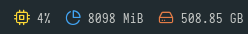
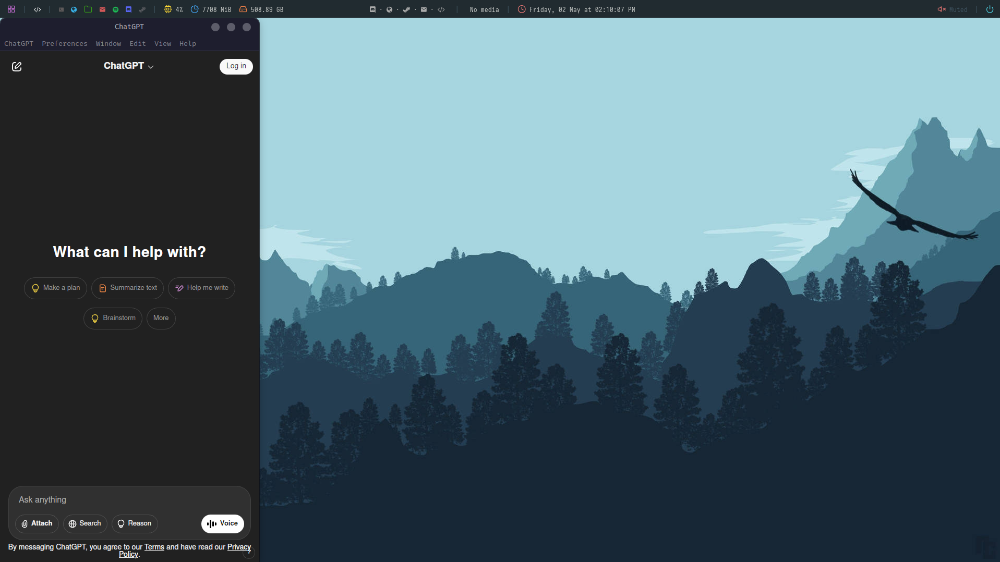

# 🌿 Mint-Gavamon (WIP)

A customized Linux Mint Cinnamon desktop that I made because I got bored

---

## 📦 Installation

```bash
git clone https://github.com/gavanleins/Mint-Gavamon ~/.config/polybar
cd ~/.config/polybar
chmod +x ./launch.sh scripts/*.sh
./launch.sh
```
⚠️ Make sure all scripts in scripts/ are executable.
---

##  Features
Custom Application Taskbar


Polywins Task Management


Live System Information





ChatGPT Sidebar




---

🧰 Dependencies

Install all necessary packages:
```
sudo apt install polybar rofi xdotool wmctrl x11-utils playerctl pavucontrol feh curl jq thunar
```
Fonts (required for icons)

    Install a Nerd Font like Iosevka, JetBrainsMono, or FiraCode
    https://www.nerdfonts.com

Highly Reccomend Installing Icons and Themes from here (I used mocha theme to make it match)
  
  https://github.com/catppuccin/catppuccin

🧠 Optional: ChatGPT Sidebar

Install the ChatGPT desktop client:
```
wget https://github.com/lencx/ChatGPT/releases/download/v1.1.0/ChatGPT_1.1.0_linux_x86_64.deb
sudo dpkg -i ChatGPT_1.1.0_linux_x86_64.deb
```
---
🥸 Credits

🌲 Polybar Forest Theme
https://github.com/adi1090x/polybar-themes

🪟 Polywins - Window Management
https://github.com/uniquepointer/polywins

🧠 ChatGPT Desktop App
https://github.com/lencx/ChatGPT

---

💡 Notes

This config is designed for Linux Mint Cinnamon, but can be adapted for any GTK-based DE with X11.

Notifications and tray behavior may vary by compositor or DE.

You can tweak ~/config/polybar/forest/scripts/polywins.sh for your app icon mappings and appearance.

If you want to add applications to your "Task Bar" edit them in ~/config/polybar/forest/user_modules.ini with this format
```
[module/NAME]
inherit = module/apps
content = (Add an icon)
content-foreground = #HEX COLOR
click-left = COMMAND &
```
Then in ~/config/polybar/forest/config.ini you can add the name of the module to "modules-left"
